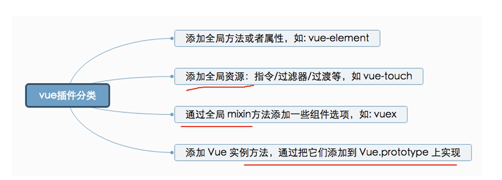

# light-ui

> a Vue.js Mobile UI Toolkit

## 介绍

`light-ui` 是基于 [vue-cli2.x](https://cli.vuejs.org/zh/guide/cli-service.html) 实现，并通过了[cube-ui](https://didi.github.io/cube-ui/#/zh-CN) 打包过程改造而成，以及将 [element-ui](https://element.eleme.cn/#/zh-CN) 中的一些组件移植进来。

我的工作：

+ 将`vue-cli2.x` 所依赖的 `packages` 升级到最新版本；
+ 在此项目中实现了`cube-ui`的打包过程；
+ 采用 `element-ui` 的默认主题，并使用 `scss`来维护
+ 将 `element-ui` 在web端的组件迁移到移动端

未完成的工作：

+ 未将工作的业务组件添加到项目

+ 未升级项目中关于单元测试的 `package`，故未实现组件的单元测试
+ 未实现项目自动部署到npm
+ 未添加其他UI库的优秀组件，例如`vant-ui`、`mint-ui`

## 组件分类



+ basic 基础组件

+ form 表单组件

+ Popup 弹窗组件

+ Data 组件

+ Scroll 滚动组件

## Build Setup

``` bash
# install dependencies
npm install

# 运行 npm 包开发使用
npm run dev

# 打包 npm 包
npm run build

# 运行开发UI组件，以及说明文档文件 --- 官网 cube.com
npm run doc-dev

# 只打包说明文档文件
npm run doc-build

# 只打包UI组件的demo
npm run demo-build

# 打包说明文档文件 和 打包UI组件的demo
npm run doc-demo-build
```

